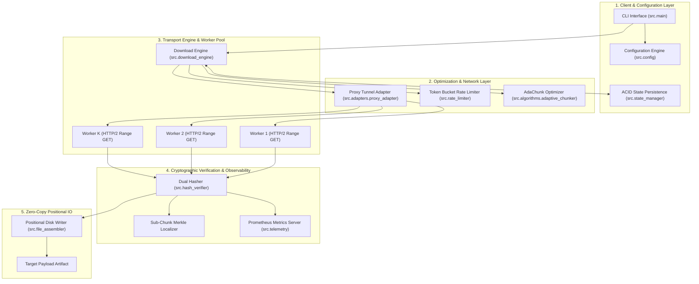

# ReliaDL: Production-Grade Resilient Download Engine

[](https://pypi.org/project/reliadl/)
[](https://pypi.org/project/reliadl/)
[](LICENSE)
[](https://github.com/PxA-Labs/ReliaDL/actions/workflows/codeql.yml)
[](https://securityscorecards.dev/viewer/?url=github.com/PxA-Labs/ReliaDL)
[](https://bestpractices.coreinfrastructure.org/projects/github.com/PxA-Labs/ReliaDL)

**ReliaDL** is a production-grade, fault-tolerant parallel file download framework and high-throughput streaming engine. Designed for high-reliability data pipelines, enterprise infrastructure, and non-stationary channels, ReliaDL combines stochastic network optimization, per-chunk cryptographic integrity verification, corporate proxy tunneling, async rate limiting, and Prometheus observability.

[PyPI Package](https://pypi.org/project/reliadl/) | [Documentation](docs/PROJECT_OVERVIEW.md) | [Release Notes](https://github.com/PxA-Labs/ReliaDL/releases) | [RFC Roadmap](https://github.com/PxA-Labs/ReliaDL/discussions/83) | [Issue Tracker](https://github.com/PxA-Labs/ReliaDL/issues)

---

## Key Capabilities

| Feature | Description | Architecture Component |
| :--- | :--- | :--- |
| **Cryptographic Integrity** | Per-chunk SHA-256 validation, homomorphic LtHash aggregation, and 4 KB Merkle tree segment localization | `src.hash_verifier` |
| **Proxy Tunneling** | SOCKS5 (RFC 1928 / 1929) and HTTP CONNECT corporate proxy tunneling with destination-based TLS verification | `src.adapters.proxy_adapter` |
| **Traffic Pacing** | Token Bucket rate limiter with single-threaded reservation scheduling preventing thundering herd spikes | `src.rate_limiter` |
| **Observability** | Native Prometheus metrics catalog exporter and structured JSON logging engine | `src.telemetry` & `src.logger` |
| **Stochastic Pacing** | Lyapunov-based dynamic chunk sizing (AdaChunk) and restless multi-armed bandit (Whittle index) scheduling | `src.algorithms` |
| **Cloud Adapters** | Plug-and-play streaming adapters for AWS S3, Google Cloud Storage (GCS), and Azure Blob Storage | `src.adapters` |

---

## Installation

### From PyPI (Recommended)

```bash
pip install reliadl
```

### From Source

```bash
git clone https://github.com/PxA-Labs/ReliaDL.git
cd ReliaDL
pip install -e .
```

### Verification

To verify that ReliaDL is correctly installed and ready to use, run these quick test commands in your terminal:

```bash
# 1. Verify package import and installation path
python -c "import reliadl; print('ReliaDL successfully imported from:', reliadl.__file__)"

# 2. Inspect package version and metadata
pip show reliadl

# 3. Test core component initialization
python -c "from reliadl import DownloadConfig; config = DownloadConfig(); print('Config initialized successfully!')"
```


---

## Quick Start & Python SDK

### 1. Basic File Download & Resume Engine

```python
import asyncio
from src.state_manager import StateManager

# Initialize resilient transfer state
state_mgr = StateManager(target_path="./downloads/large_dataset.tar.gz")
print(f"Transfer state initialized: {state_mgr}")
```

### 2. Corporate Proxy Tunneling (SOCKS5 & HTTP CONNECT)

```python
from src.adapters.proxy_adapter import ProxyConfig, ProxyType, ProxyTunnel

# Configure SOCKS5 proxy with remote DNS resolution
proxy_config = ProxyConfig(
    proxy_type=ProxyType.SOCKS5H,
    host="proxy.corp.internal",
    port=1080,
    username="service_account",
    password="secure_password"
)

# Open secure tunnel to destination endpoint
tunnel = ProxyTunnel(proxy_config, timeout=30.0)
connection = tunnel.open("secure.example.com", 443)
```

### 3. Bandwidth Rate Limiting (Token Bucket)

```python
import asyncio
from src.rate_limiter import TokenBucketRateLimiter

async def main():
    # Throttle transfer rate to 10 MB/s with a 2 MB burst capacity
    limiter = TokenBucketRateLimiter(rate=10 * 1024 * 1024, capacity=2 * 1024 * 1024)
    
    # Compute and acquire bandwidth delay before downloading next chunk
    delay = await limiter.acquire(64 * 1024)
    print(f"Paced chunk delay: {delay:.4f} seconds")

asyncio.run(main())
```

### 4. Prometheus Telemetry Monitoring

```python
from src.telemetry.metrics import DownloadMetrics, MetricsRegistry, MetricsServer

registry = MetricsRegistry()
metrics = DownloadMetrics(registry)

# Record chunk transfer telemetry
metrics.record_chunk(bytes_count=65536, duration_seconds=0.012, mirror="us-east-1")

# Launch background HTTP metrics server for Prometheus scrapers on port 9090
with MetricsServer(registry, port=9090) as server:
    print("Prometheus scraper active at http://localhost:9090/metrics")
```

### 5. Cryptographic Stream Hash Verification

```python
from src.hash_verifier import StreamingHashVerifier, constant_time_compare

# Initialize streaming SHA-256 verifier
verifier = StreamingHashVerifier(algorithm="sha256")
verifier.update(b"chunk byte payload data...")

# Compute digest and compare in constant time
digest = verifier.hexdigest()
is_valid = constant_time_compare(digest, "b94d27b9934d3e08a52e52d7da7dabfac484efe37a5380ee9088f7ace2efcde9")
print(f"Payload valid: {is_valid}")
```

---

## Command Line Interface (CLI)

ReliaDL includes a CLI for automated background file transfers and file verification:

```bash
# Execute a parallel download with adaptive chunking
python -m src.main download \
  --url "https://example.com/dataset.tar.gz" \
  --output "./downloads/dataset.tar.gz" \
  --adachunk \
  --whittle

# Resume an interrupted file transfer
python -m src.main resume \
  --state-file "./downloads/.reliadl/dataset.tar.gz.state"

# Verify payload integrity against expected SHA-256 digest
python -m src.main verify \
  --file "./downloads/dataset.tar.gz" \
  --expected-hash "sha256:e3b0c44298fc1c149afbf4c8996fb92427ae41e4649b934ca495991b7852b855"
```

---

## System Architecture



---

## Repository & Module Structure

```text
ReliaDL/
├── README.md                          # Project documentation entry point
├── pyproject.toml                     # PEP 517/518 PyPI build configuration
├── LICENSE                            # Apache 2.0 License
├── requirements.txt                   # Dependency manifests
│
├── .github/
│   ├── dependabot.yml                 # Automated weekly security updates
│   └── workflows/
│       ├── codeql.yml                 # CodeQL static security analysis
│       ├── ci.yml                     # Continuous integration test matrix
│       └── publish.yml                # PyPI Trusted Publisher (OIDC) workflow
│
├── docs/                              # Architecture documentation & research specifications
│   ├── NOVEL_ALGORITHMS.md            # Formal mathematical formulations & proofs
│   ├── ARCHITECTURE.md                # System design trade-offs
│   ├── API_REFERENCE.md               # API documentation
│   └── OBSERVABILITY.md               # Prometheus telemetry guide
│
├── src/                               # Core engine modules
│   ├── adapters/                      # Transport & proxy adapters
│   │   ├── proxy_adapter.py           # SOCKS5 & HTTP CONNECT corporate tunneling
│   │   ├── s3_adapter.py              # AWS S3 cloud adapter
│   │   ├── gcs_adapter.py             # Google Cloud Storage adapter
│   │   └── azure_adapter.py           # Azure Blob Storage adapter
│   ├── algorithms/                    # Stochastic optimization algorithms
│   │   ├── adaptive_chunker.py        # AdaChunk Lyapunov optimizer
│   │   ├── metrics_collector.py       # EWMA network estimator
│   │   ├── mirror_bandit.py           # Whittle index bandit scheduler
│   │   └── work_stealer.py            # Dynamic work stealing queue
│   ├── hash_verifier.py               # Streaming SHA-256 & LtHash verifier
│   ├── rate_limiter.py                # Token bucket bandwidth rate limiter
│   ├── telemetry/                     # Prometheus telemetry & exporter
│   ├── state_manager.py               # Atomic state file manager
│   ├── file_assembler.py              # Zero-copy positional disk assembler
│   ├── config.py                      # System configuration parser
│   ├── exceptions.py                  # Custom taxonomy exceptions
│   └── main.py                        # Command Line Interface (CLI)
│
└── tests/                             # Automated test suite (860+ tests passing)
    └── unit/                          # Component unit tests
```

---

## Security, Governance & Compliance

ReliaDL adheres to strict enterprise security standards and the [Open Source Security Foundation (OpenSSF)](https://openssf.org/) guidelines:

* **CodeQL Static Security Analysis**: Continuous automated scanning for security vulnerabilities on every push and pull request.
* **Dependabot Vulnerability Management**: Weekly automated dependency updates for `pip` packages and GitHub Actions.
* **PyPI Trusted Publisher (OIDC)**: Tokenless, passwordless release publishing using OpenID Connect and GitHub Artifact Attestations.
* **Cryptographic Supply Chain Verification**: SHA-256 digest validation and signed manifest catalogs preventing payload tampering.
* **Vulnerability Reporting**: Coordinated security disclosure policy detailed in [SECURITY.md](docs/SECURITY.md).

---

## Distribution RFC & Multi-Phase Roadmap

ReliaDL is executing a multi-phase distribution roadmap discussed in **[RFC Discussion #83](https://github.com/PxA-Labs/ReliaDL/discussions/83)**:

- **Phase 1 (Core)**: [PyPI Package](https://pypi.org/project/reliadl/) ([Issue #84](https://github.com/PxA-Labs/ReliaDL/issues/84)) & [MkDocs Documentation](https://github.com/PxA-Labs/ReliaDL/issues/85).
- **Phase 2 (Binaries & Containers)**: [Standalone Executables](https://github.com/PxA-Labs/ReliaDL/issues/86) & [GHCR Docker Image](https://github.com/PxA-Labs/ReliaDL/issues/87).
- **Phase 3 (Package Managers)**: [Homebrew / WinGet / Linux Package Managers](https://github.com/PxA-Labs/ReliaDL/issues/88).

---

## Research Reference

If you use ReliaDL in academic research or production system studies, please cite:

```bibtex
@article{reliadl2026,
  title={{ReliaDL: Adaptive Fault-Tolerant Chunked Transfer with Homomorphic Verification and Stochastic Scheduling}},
  author={Joshi, Purvansh and Mittal, Archit},
  journal={arXiv preprint arXiv:2608.xxxxx},
  year={2026},
  publisher={PxA Labs},
  url={https://github.com/PxA-Labs/ReliaDL}
}
```

---

## License

ReliaDL is open-source software licensed under the **[Apache License 2.0](LICENSE)**.
