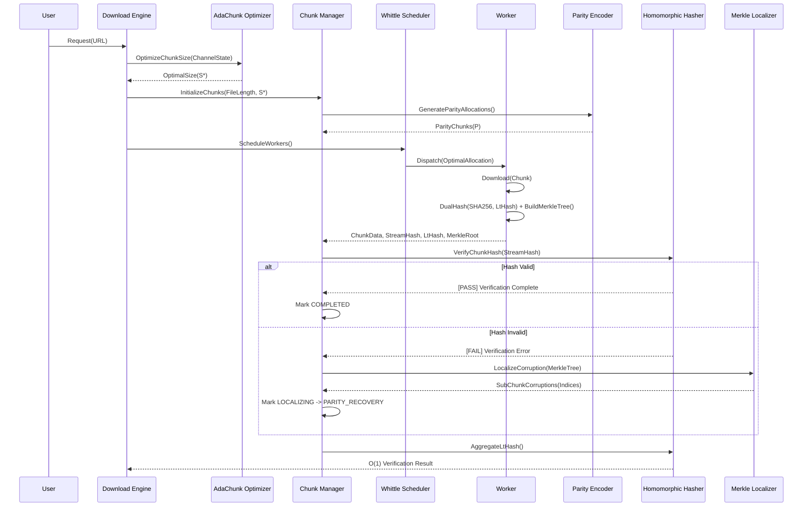
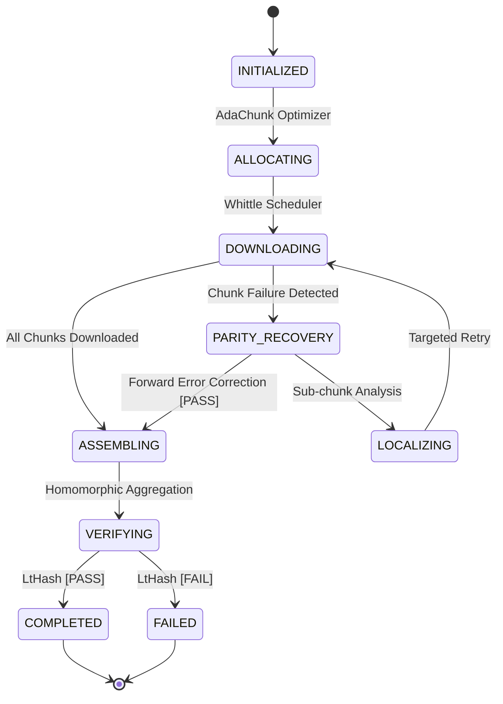
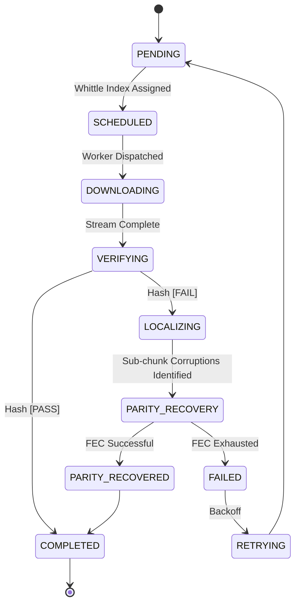

# 1. ReliaDL Data Flow and System Architecture

This document formally specifies the data flow, state transitions, and architectural interactions within the ReliaDL (formerly ReliaDL) reliable download system. ReliaDL leverages advanced cryptographic primitives, stochastic optimization, and forward error correction to ensure mathematically rigorous fault tolerance.

## 2. End-to-End Sequence Architecture

The system incorporates several novel contributions:
- **AdaChunk**: Adaptive chunk sizing using the Lyapunov drift-plus-penalty framework.
- **Homomorphic Hash Aggregation**: $\mathcal{O}(1)$ whole-file verification via LtHash.
- **Sub-chunk Merkle Localization**: Hierarchical Merkle trees for fine-grained corruption localization.
- **Predictive Parity Injection**: Forward error correction via a Gilbert-Elliott channel model.
- **Stochastic Optimal Worker Scheduling**: Restless multi-armed bandit (RMAB) Whittle index policy.



## 3. State Machine Formalisms

### 3.1 Download State Machine

The download lifecycle encompasses the initialization, stochastic scheduling, targeted localization, parity recovery, and homomorphic verification phases.



### 3.2 Chunk State Machine

Individual chunks follow a rigorous progression to ensure integrity at the sub-chunk granularity.



## 4. Data Path Formulations

### 4.1 Chunk Download and Dual Hashing

During the download phase, Workers perform a concurrent dual-hash computation: a standard SHA-256 stream hash and a lattice-based homomorphic hash (LtHash). The optimal chunk size $S^*$ is determined continuously via AdaChunk, optimizing the trade-off between throughput and failure penalty:

$$ S^* = \arg\max_{S} \mathbb{E}[U(S) - V \cdot Q(t)] $$

Simultaneously, the worker constructs a hierarchical Merkle tree over sub-chunk blocks $B$ to support subsequent error localization.

### 4.2 Assembly and Homomorphic Aggregation

Traditional assembly mechanisms require $\mathcal{O}(N)$ re-reading of the assembled file to verify its integrity. ReliaDL implements an $\mathcal{O}(1)$ whole-file verification scheme utilizing homomorphic hashing. The final file hash $\mathcal{H}(F)$ is defined mathematically as the modulo sum of individual chunk hashes:

$$ \mathcal{H}(F) = \sum_{i=1}^N \mathcal{H}(C_i) \pmod q $$

This guarantees verification without subsequent disk I/O penalties.

## 5. Concurrency and Optimal Scheduling

The Whittle Scheduler models dynamic worker-to-source allocation as a Restless Multi-Armed Bandit (RMAB) problem. By computing the Whittle index $W_i(s)$ for each source stream state $s$, the scheduler maximizes global throughput under strict concurrency constraints. 

$$ W_i(s) = \inf \{ \lambda : \text{Passive action is optimal in state } s \text{ under subsidy } \lambda \} $$

## 6. Error Recovery and Localization

### 6.1 Merkle Localization Path

Upon verification failure, the Chunk Manager transitions to the `LOCALIZING` state. The Merkle Localizer executes an $\mathcal{O}(\log(S/B))$ traversal of the previously constructed Merkle tree. By comparing root and intermediate hashes, the system pinpoints corrupt segments at a sub-chunk granularity, entirely eliminating the need for full chunk re-transmission.

### 6.2 Predictive Parity Recovery

To mitigate latency in high-loss environments, ReliaDL proactively injects lightweight XOR-based parity chunks. The parity injection rate $\rho$ is governed by a Gilbert-Elliott channel model estimator, distinguishing between "Good" and "Bad" network states. The `PARITY_RECOVERY` state allows zero-RTT recovery from parity, proceeding to backoff-based `RETRYING` only upon parity exhaustion.

## 6. Error Propagation Flow

```
  Error occurs in Worker
         │
         ▼
  ┌──────────────────────────────────┐
  │  Classify error                  │
  │  - Is it retryable?             │
  │  - What's the HTTP status?       │
  │  - What exception type?          │
  └──────────┬───────────────────────┘
             │
        ┌────┴────┐
        │         │
   Retryable  Non-Retryable
        │         │
        ▼         ▼
   Increment   Mark chunk
   attempt     ABANDONED
   counter         │
        │         ▼
        ▼    Log error with
   Compute   full context
   backoff       │
   delay         ▼
        │    Check: are ALL
        ▼    chunks ABANDONED?
   Sleep &       │
   retry    ┌────┴────┐
             │         │
            NO        YES
             │         │
             ▼         ▼
          Continue   Mark download
          (other     as FAILED
          chunks     Notify user
          may        via callback
          succeed)   & exit code
```

---

## 7. Direct Sparse Write Data Flow

```
Download Initialized (--direct-write)
       │
       ▼
[ Pre-allocate target file ] ──▶ posix_fallocate(fd, 0, file_size)
       │
       ▼
[ Launch Worker Coroutines ]
       │
       ├── Worker 0 ──▶ fetch chunk 0 ──▶ verify SHA-256 ──▶ os.pwrite(fd, buf, 0)
       ├── Worker 1 ──▶ fetch chunk 1 ──▶ verify SHA-256 ──▶ os.pwrite(fd, buf, 8388608)
       └── Worker N ──▶ fetch chunk N ──▶ verify SHA-256 ──▶ os.pwrite(fd, buf, offset_N)
       │
       ▼
[ All Chunks Verified & Written ]
       │
       ▼
[ os.fsync(fd) & Whole-File SHA-256 Check ]
       │
       ▼
[ Download Complete — Zero Assembly Delay ]
```

---

## 8. Manifest-Driven Verification Flow

```
[ User provides .cgmanifest ]
       │
       ▼
[ Verify Cryptographic Signature (Ed25519) ]
       │
       ├── ❌ Signature Invalid ──▶ Abort (Untrusted Manifest)
       └── ✅ Signature Valid   ──▶ Load pre-authenticated chunk hashes & mirrors
                                          │
                                          ▼
                             [ Concurrent Range GETs ]
                             [ across prioritized mirrors ]
                                          │
                                          ▼
                             [ Per-chunk SHA-256 checked ]
                             [ against signed manifest ]
                                          │
                                          ▼
                             [ Match Merkle Tree Root ]
                                          │
                                          ▼
                             [ Success — Cryptographic Proof ]
```
