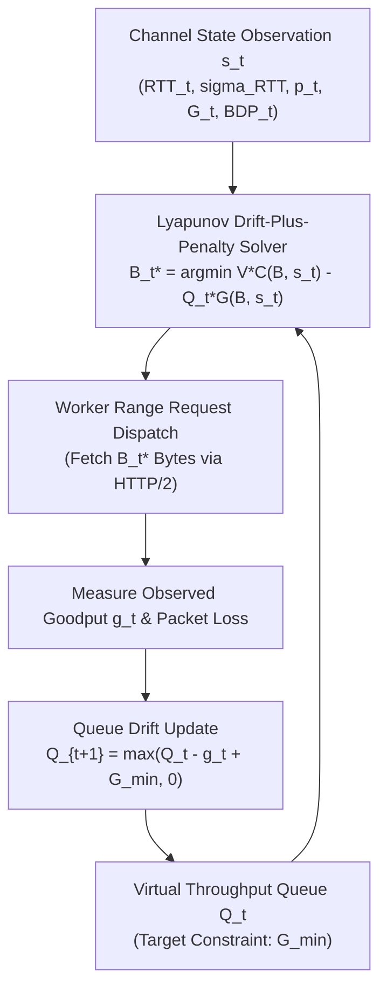
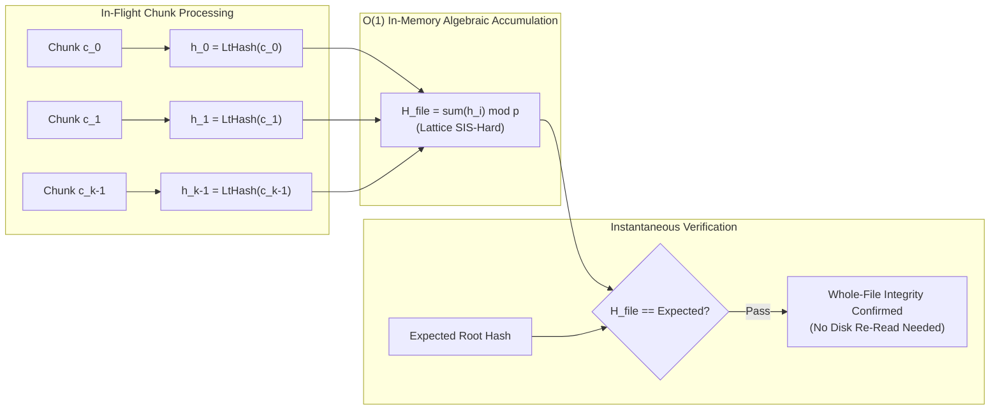
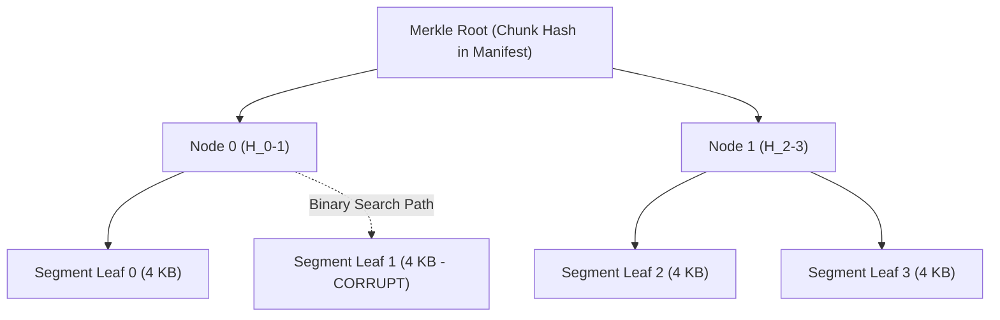
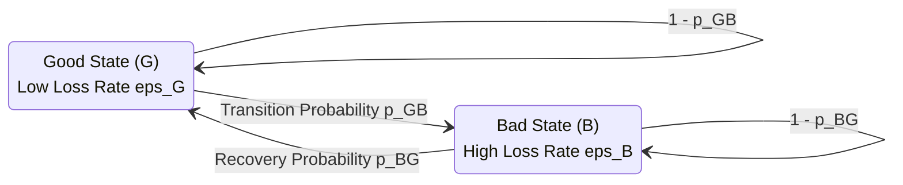
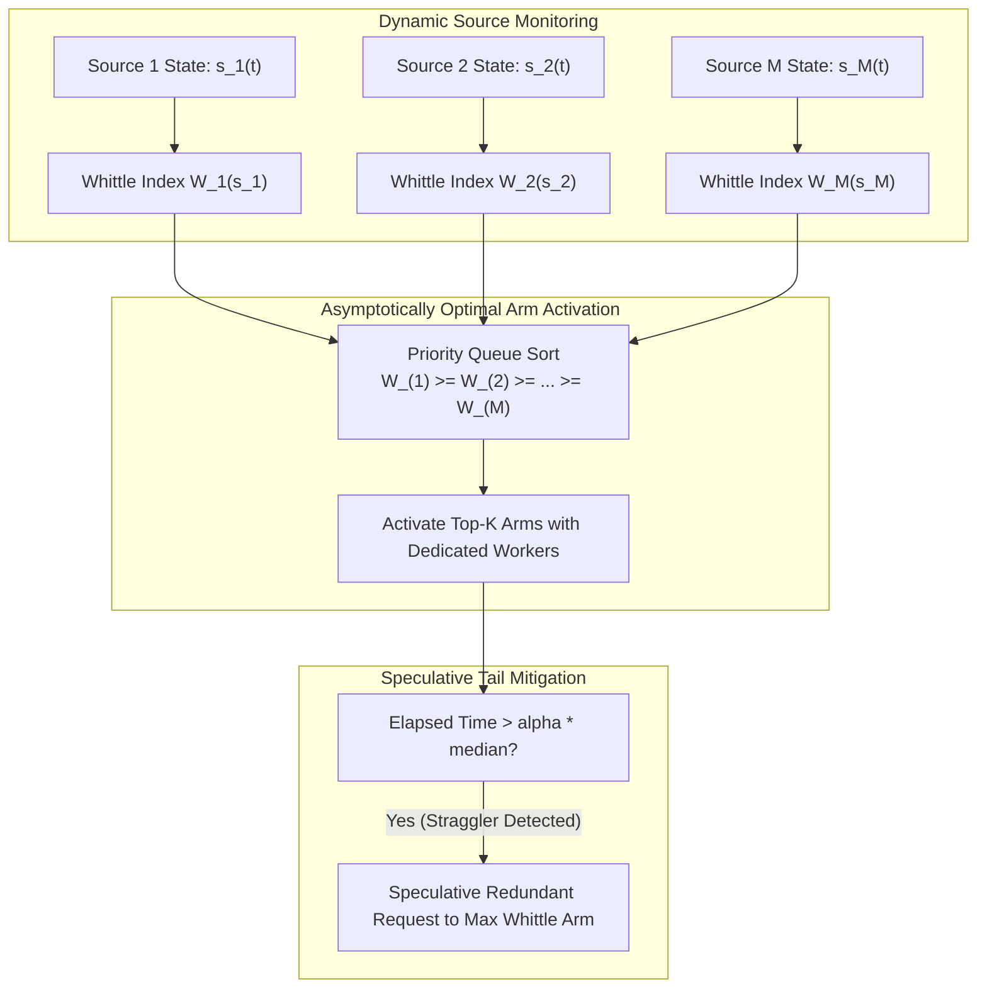
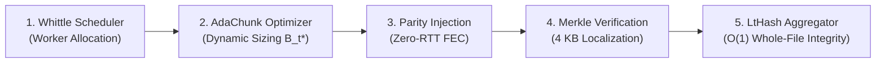

# ReliaDL: Algorithmic Foundations and Novel Contributions

This document formalizes the core algorithmic contributions of the ReliaDL architecture. Each section details the problem formulation, theoretical models, proposed solutions, and complexity bounds.

## 1. AdaChunk: Lyapunov-Based Adaptive Chunk Sizing

### Problem Formulation
Static chunk sizing is demonstrably suboptimal under non-stationary network conditions. We formalize the network state as a stochastic process and model the chunk sizing problem as an online optimization task.

### System Model
Let the network state vector at discrete time slot $t$ be defined as $s_t = (\text{RTT}_t, \sigma_{\text{RTT}, t}, p_t, G_t, \text{BDP}_t)$, where $p_t$ denotes the packet loss rate, $G_t$ is the goodput ratio, and $\text{BDP}_t$ is the bandwidth-delay product.

### Optimization Objective
The objective is to minimize the long-term expected retransmission cost subject to a strict throughput constraint:

$$ \min \lim_{T \to \infty} \frac{1}{T} \sum_{t=0}^{T-1} \mathbb{E}[C(B_t, s_t)] $$

subject to:

$$ \lim_{T \to \infty} \frac{1}{T} \sum_{t=0}^{T-1} \mathbb{E}[G(B_t, s_t)] \geq G_{\min} $$

where $B_t \in [B_{\min}, B_{\max}]$ is the chosen chunk size at time $t$, $C(\cdot)$ is the retransmission cost function, and $G(\cdot)$ is the goodput function.

### Lyapunov Drift-Plus-Penalty Framework
To solve this constrained stochastic optimization problem, we employ the Lyapunov Drift-plus-Penalty framework. We introduce a virtual queue $Q_t$ to enforce the throughput constraint:

$$ Q_{t+1} = \max(Q_t - G(B_t, s_t) + G_{\min}, 0) $$

The drift-plus-penalty expression to be minimized at each time slot is defined as:

$$ \Delta(Q_t) + V \cdot C(B_t, s_t) $$

where $V > 0$ is a control parameter determining the tradeoff between cost minimization and constraint satisfaction. The per-slot deterministic optimization problem becomes:

$$ B_t^* = \arg\min_{B \in [B_{\min}, B_{\max}]} \left( V \cdot C(B, s_t) - Q_t \cdot G(B, s_t) \right) $$

### Retransmission Cost and Goodput Models
The expected retransmission cost $C(B, s)$ is proportional to the probability of chunk failure:

$$ C(B, s) = B \cdot p_{\text{retry}}(B, s) $$

where $p_{\text{retry}} = 1 - (1-p)^{B/\text{MSS}}$ under independent packet loss assumptions, and $\text{MSS}$ is the Maximum Segment Size.

The goodput model is given by:

$$ G(B, s) = \frac{B \cdot (1 - p_{\text{retry}})}{T_{\text{download}}(B, s) + T_{\text{overhead}}} $$

### Convergence Theorem
**Theorem 1.** *Assuming independent and identically distributed network states $s_t$, the AdaChunk algorithm achieves a time-average expected cost that is within $\mathcal{O}(1/V)$ of the theoretical optimum, with a corresponding time-average queue backlog bounded by $\mathcal{O}(V)$.*

### Algorithm (Pseudocode)
```text
Algorithm 1: AdaChunk Online Optimization
Require: Control parameter V > 0, throughput target G_min
Initialize: Q_0 = 0
For each time slot t = 0, 1, 2, ... do:
    1. Observe current network state s_t
    2. Solve for optimal chunk size:
       B_t^* = argmin_{B} ( V * C(B, s_t) - Q_t * G(B, s_t) )
    3. Execute download for chunk of size B_t^*
    4. Measure actual goodput g_t
    5. Update virtual queue: Q_{t+1} = max(Q_t - g_t + G_min, 0)
End For
```

### AdaChunk Optimization Cycle



**Complexity:** The per-slot optimization admits a closed-form solution via Karush-Kuhn-Tucker (KKT) conditions, yielding a time complexity of $\mathcal{O}(1)$ per chunk decision.

## 2. Homomorphic Hash Aggregation via Lattice-Based Hashing (LtHash)

### Problem Formulation
Standard SHA-256 whole-file verification requires an $\mathcal{O}(N)$ disk I/O pass post-assembly, presenting a severe bottleneck for large files.

### LtHash Construction
We utilize LtHash, a lattice-based homomorphic hash function $H: \{0,1\}^* \to \mathbb{Z}_p^n$. The homomorphic property guarantees that for any inputs $x, y$:

$$ H(x \parallel y) = H(x) + H(y) \pmod p $$

### Formal Definition
Choose a random public matrix $A \in \mathbb{Z}_p^{n \times m}$. For an input vector $x \in \mathbb{Z}_p^m$ with small coefficients:

$$ H(x) = A \cdot x \pmod p $$

For a file partitioned into chunks $c_0, c_1, \dots, c_{k-1}$:

$$ H(c_0 \parallel c_1 \parallel \dots \parallel c_{k-1}) = \sum_{i=0}^{k-1} H(c_i) \pmod p $$

### Whole-File Hash Construction
- **During download:** Compute partial hashes $h_i = \text{LtHash}(c_i)$ as chunks arrive.
- **After assembly:** Compute the aggregated file hash $H_{\text{file}} = \sum_{i=0}^{k-1} h_i \pmod p$.
- **Verification:** Compare $H_{\text{file}}$ with the expected root hash. Verification requires $\mathcal{O}(1)$ operations without re-reading the assembled file.

### Security Analysis
The collision resistance of LtHash reduces to the Short Integer Solution (SIS) problem, a well-known hard problem on lattices. Achieving a security parameter of $\lambda$ bits requires $n = \mathcal{O}(\lambda)$ and $p = \mathcal{O}(2^\lambda)$.

### Dual-Layer Verification
ReliaDL employs a dual-layer verification strategy: SHA-256 is used for per-chunk integrity (ensuring backward compatibility), while LtHash enables $\mathcal{O}(1)$ whole-file aggregation. The space complexity is $\mathcal{O}(n \log p)$ bits per chunk hash.

| Metric | SHA-256 (Traditional) | LtHash (ReliaDL) |
| :--- | :--- | :--- |
| Post-Assembly Verify Time | $\mathcal{O}(N)$ (Disk I/O bound) | $\mathcal{O}(1)$ (In-memory add) |
| Homomorphic | [FAIL] | [PASS] |
| Quantum Resistance | Post-quantum secure | Post-quantum secure (SIS) |

### Homomorphic Verification Flowchart



## 3. Sub-Chunk Merkle Localization

### Problem Formulation
In conventional designs, a single corrupted byte in an 8MB chunk forces the re-download of the entire 8MB, wasting significant bandwidth.

### Hierarchical Merkle Tree Construction
Each chunk of size $B$ is partitioned into segments of size $s$ (default $s = 4096$ bytes). This yields $k = \lceil B/s \rceil$ leaf nodes. The tree height is $h = \lceil \log_2(k) \rceil$.
For any internal node:

$$ H(\text{node}) = \text{SHA-256}(H(\text{left\_child}) \parallel H(\text{right\_child})) $$

The root hash serves as the per-chunk hash in the manifest.

### Corruption Localization Algorithm
Given a received chunk and the expected Merkle root from the manifest, the algorithm performs a binary search through the tree, requiring $\mathcal{O}(\log k)$ hash comparisons to identify the minimum set of corrupted segments $S_{\text{corrupt}}$. The re-download volume is strictly $\sum_{s \in S_{\text{corrupt}}} |s|$ bytes.

### Expected Retransmission Savings
- Without Merkle: $\mathbb{E}[\text{retransmit}] = B$
- With Merkle: $\mathbb{E}[\text{retransmit}] = s \cdot \mathbb{E}[|S_{\text{corrupt}}|] + \text{overhead}(\text{proof})$

For a single-bit error in an 8MB chunk, the savings ratio is:

$$ 1 - \frac{s}{B} = 1 - \frac{4096}{8388608} \approx 99.95\% $$

The Merkle proof size is bounded by $\mathcal{O}(h \cdot \text{hash\_size}) = \mathcal{O}(\log(B/s) \cdot 32)$ bytes.

### Algorithm (Pseudocode)
```text
Algorithm 2: Sub-Chunk Corruption Localization
Require: Received chunk data, expected RootHash
1. Reconstruct Merkle tree T from received chunk data
2. Initialize S_corrupt = empty set, Queue = [(RootNode, RootHash)]
3. While Queue is not empty:
     (Node, ExpectedHash) = Queue.pop()
     If T.hash(Node) != ExpectedHash:
        If Node is Leaf:
           S_corrupt.add(Node.segment_index)
        Else:
           Fetch ExpectedLeftHash, ExpectedRightHash from server proof
           Queue.push((Node.left, ExpectedLeftHash))
           Queue.push((Node.right, ExpectedRightHash))
4. Return S_corrupt
```

### Merkle Localization Tree Structure



## 4. Predictive Parity Injection

### Problem Formulation
Standard ARQ (Automatic Repeat reQuest) incurs a minimum 1 RTT penalty per corrupted chunk, degrading throughput on high-latency links.

### Gilbert-Elliott Channel Model
We model the network channel using a two-state Markov chain: Good (G) and Bad (B), with transition probabilities $p_{GB}$ and $p_{BG}$. The loss rates are $\epsilon_G$ and $\epsilon_B$ (where $\epsilon_G \ll \epsilon_B$). State estimation is performed continuously via an online Maximum Likelihood Estimator (MLE) or Baum-Welch algorithm.

### Parity Chunk Construction
For a sequence of $k$ data chunks, we generate $r$ parity chunks using systematic XOR coding. Parity chunk $P_j$ is the XOR sum of a designated subset of data chunks. The code rate is $R = \frac{k}{k+r}$. The receiver can recover from up to $r$ lost chunks.

### Adaptive Injection Rate Algorithm
Using the forward algorithm, we estimate the channel state probabilities $\pi_G(t)$ and $\pi_B(t)$. The expected loss rate is:

$$ \hat{p}(t) = \pi_G(t) \cdot \epsilon_G + \pi_B(t) \cdot \epsilon_B $$

The optimal redundancy parameter $r^*(t)$ is computed as:

$$ r^*(t) = \left\lceil k \cdot \frac{\hat{p}(t)}{1 - \hat{p}(t)} \right\rceil $$

subject to $r \leq r_{\max}$ to tightly bound bandwidth overhead.

### Recovery Protocol
Upon detecting a lost or corrupted chunk, the receiver reconstructs it in $\mathcal{O}(B)$ computational steps using the available $k$ data chunks and parity chunks, achieving zero-RTT recovery. The bandwidth overhead ratio is $\frac{r}{k+r}$.

### Gilbert-Elliott Channel State Transition Model



## 5. Whittle Index Worker Scheduling

### Problem Formulation
Static FIFO scheduling is substantially suboptimal when downloading from heterogeneous multi-source environments (e.g., decentralized mirrors).

### Restless Multi-Armed Bandit Formulation
We model the scheduling problem as a Restless Multi-Armed Bandit (RMAB). There are $N$ arms (sources) and $K$ activations (workers) per time slot. The state of arm $i$ is $s_i(t) = (\text{throughput}_i, \text{latency}_i, \text{loss\_rate}_i, \text{queue\_depth}_i)$. The reward $r_i(s_i, a_i)$ is the goodput achieved.
The objective is to maximize the discounted infinite-horizon reward:

$$ \max \sum_{t=0}^{\infty} \gamma^t \sum_{i=1}^N r_i(s_i(t), a_i(t)) \quad \text{s.t.} \quad \sum_{i=1}^N a_i(t) = K $$

### Whittle Index Policy
We introduce a subsidy $w$ representing the opportunity cost of passive action. The Whittle index $W_i(s_i)$ is the minimum subsidy required to render the active and passive actions equally desirable:

$$ W_i(s_i) = \inf \{ w \in \mathbb{R} : V_{\text{active}}(s_i, w) = V_{\text{passive}}(s_i, w) \} $$

At each scheduling interval, the policy activates the $K$ arms with the highest Whittle indices.

### Indexability and Closed-Form Approximation
**Theorem 2.** *The passive set $D(w)$ is monotonically increasing with $w$, establishing the indexability of the proposed RMAB model.*
For a simplified two-state source model, the Whittle index admits a closed form:

$$ W(s) = \frac{\mu_{\text{active}}(s) - \mu_{\text{passive}}(s)}{1 - \gamma} $$

where $\mu(s)$ is the expected throughput.

### Straggler Mitigation
Stragglers are identified when a chunk's elapsed download time exceeds $\alpha \cdot \text{median}$. Straggler chunks are immediately re-assigned to the source with the maximum current Whittle index via speculative redundant requests.

### Algorithm (Pseudocode)
```text
Algorithm 3: Whittle Index Scheduler
Require: K available workers, N sources
1. For each source i in {1..N}:
     Update state estimator for s_i(t)
     Compute Whittle Index W_i(s_i(t))
2. Sort sources such that W_{(1)} >= W_{(2)} >= ... >= W_{(N)}
3. Assign available workers to sources (1) through (K)
4. For active downloads > alpha * median_time:
     Issue redundant request to source with max Whittle Index
```

### Whittle Index Allocation and Straggler Mitigation Workflow



## 6. Integrated System: Algorithmic Pipeline

The ReliaDL architecture executes these algorithms in a synchronized pipeline to guarantee optimality bounds and minimal overhead.

**Pipeline Flow:**
1. **Scheduler:** The Whittle Index policy assigns a worker to a source.
2. **Chunk Sizing:** AdaChunk computes the optimal chunk size $B_t^*$ for the assigned source.
3. **Download & FEC:** Predictive Parity Injection attaches zero-RTT recovery codes based on real-time channel state.
4. **Verification (Chunk):** Sub-Chunk Merkle Localization isolates byte-level errors if parity recovery fails, minimizing re-downloads.
5. **Verification (File):** LtHash continuously aggregates chunk hashes, concluding with an $\mathcal{O}(1)$ whole-file validation pass.

### Integrated Algorithmic Pipeline Flowchart



Combined time complexity per byte downloaded is $\mathcal{O}(1)$ with negligible constant factors governed by XOR operations and finite field modular additions.

